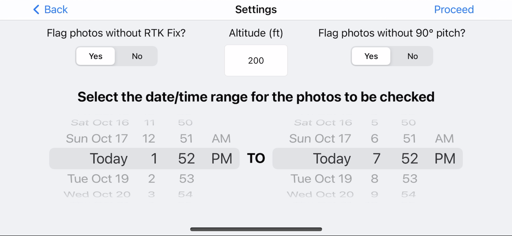
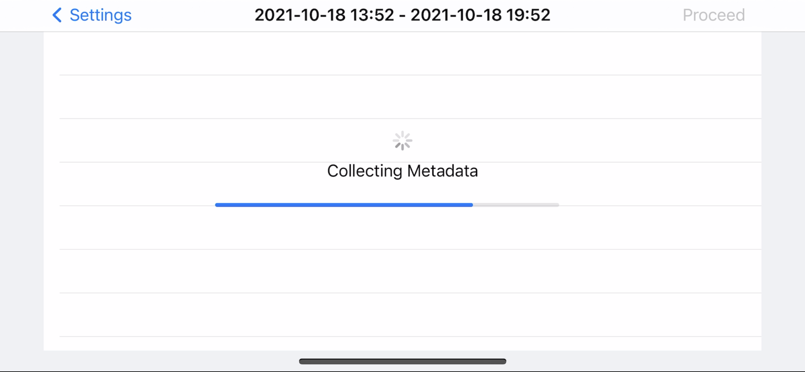
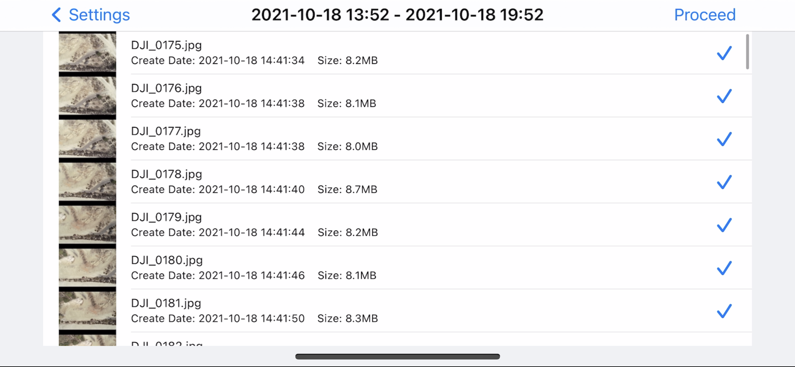
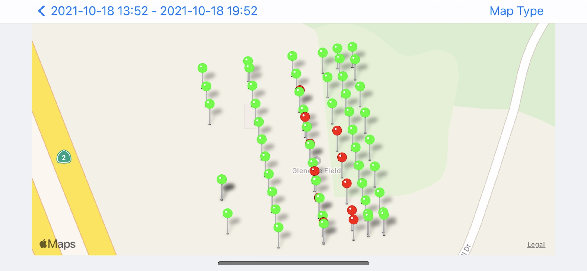
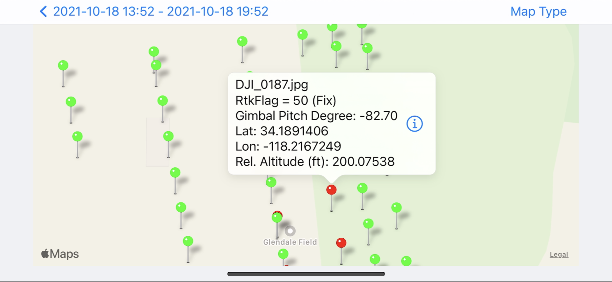
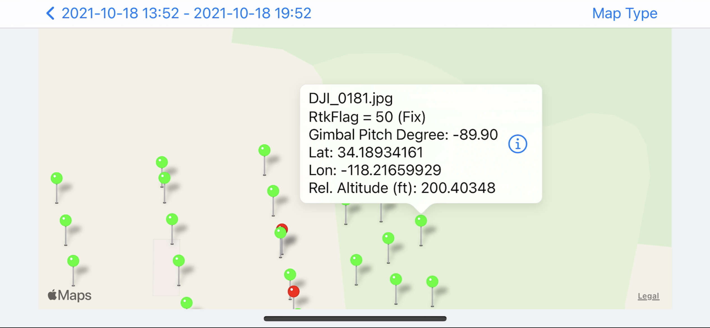

# DronePhotoChecker
iOS App that allows a pilot to check drone photo collection after a mapping mission for any issues.

**Features:**

- Connects to DJI drone
- Allows user to select date/time of captured photos to check, and parameters to flag (gimbal pitch, rtk status, altitude)
- Downloads a list of photo information and gets xmp information of photos
- String manipulation pulls critical information from xmp information
- Photos mapped with pins, red pin if any parameter preferences are not met, green pin if ok
- Tap on pin to see key information from photo in custom annotation, and click on button to preview thumbnail

**App Screenshots**

       

